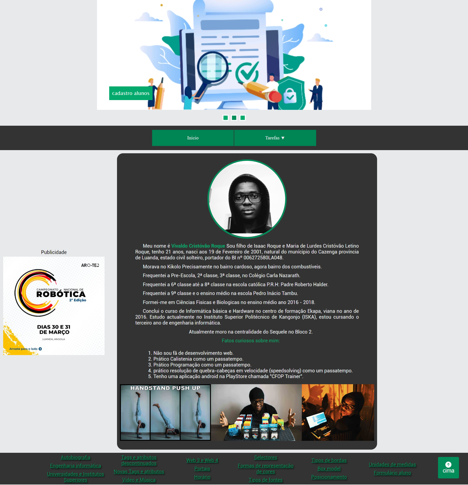
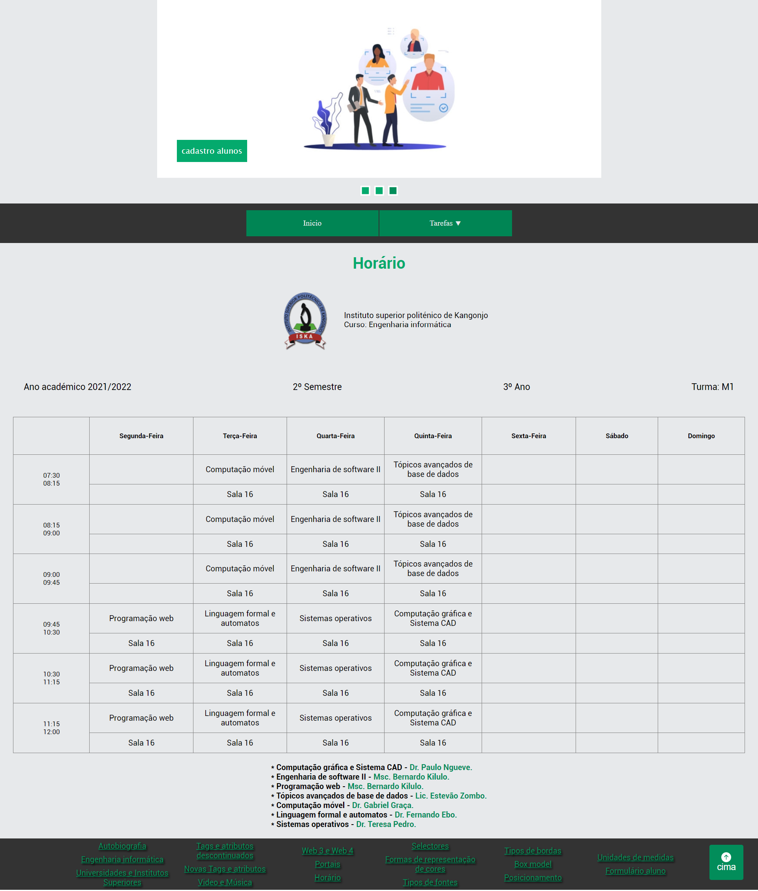

  <h1>ProgWebTarefas</h1>

<h4 align="center"> 
	Terminado ✅
</h4>

  <a href="#-descrição-do-projeto">Descrição</a> •
  <a href="#-demonstração">Demonstração</a> •
  <a href="#-layout">Layout</a> • 
  <a href="#-acesso-ao-projeto">Como aceder ao projeto</a> • 
  <a href="#-tecnologias">Tecnologias</a> • 
  <a href="#-como-contribuir-para-o-projeto">Como contribuir</a> • 
  <a href="#-autor">Autor</a> • 
  <a href="#-licença">Licença</a>

## 📝 Descrição do Projeto
**ProgWebTarefas** –  É um projeto web onde fui fazendo as tarefas da cadeira de programação web.
Essas tarefas são:

- Fazer uma autobiografia;
- Falar sobre a Engenharia informática;
- Falar sobre as Universidades e Institutos Superiores;
- Falar sobre as tags e atributos descontinuados;
- Falar sobre as novas tags e atributos;
- Incorporar um Video e Música;
- Falar sobre a Web 3 e Web 4;
- Falar sobre os Portais;
- Elaborar um horário igual ao da turma Horário;
- Falar sobre os selectores;
- Falar sobre as formas de representação de cores;
- Falar sobre os tipos de fontes;
- Falar sobre os tipos de bordas;
- Falar sobre o box model;
- Falar sobre o posicionamento;
- Falar sobre as unidades de medidas;
- Fazer um formulário para inscrição de aluno;
- Fazer um Layout 2 colunas;
- Fazer um Layout 3 colunas.

## 🕹️ Demonstração
- <a href="https://vivaldo-roque.github.io/ProgWebTarefas/" target="_blank">ProgWebTarefas</a>

## 🎨 Layout

## 📁 Acesso ao Projeto
Você pode [acessar o código fonte do projeto inicial](/) ou [baixá-lo](https://github.com/Vivaldo-Roque/ProgWebTarefas/archive/refs/heads/master.zip).

### 🎲 Abrir e rodar
Antes de começar, você vai precisar ter instalado em sua máquina a seguinte ferramenta:
- [VSCode](https://code.visualstudio.com/).
Após instalar o VsCode vais precisar da seguinte extensão para o mesmo:
- [Live Server](https://marketplace.visualstudio.com/items?itemName=ritwickdey.LiveServer).

## 💻 Tecnologias
- [HTML](https://www.w3schools.com/html/);
- [CSS](https://www.w3schools.com/css/);
- [JAVASCRIPT](https://www.w3schools.com/js/).

## 💪 Como contribuir para o projeto
1. Faça um **fork** do projeto.
2. Crie uma nova branch com as suas alterações: `git checkout -b my-feature`
3. Salve as alterações e crie uma mensagem de commit contando o que você fez: `git commit -m "feature: My new feature"`
4. Envie as suas alterações: `git push origin my-feature`
> Caso tenha alguma dúvida confira este [guia de como contribuir no GitHub](./CONTRIBUTING.md)

## 👨‍💻 Autor
[Vivaldo Roque](https://github.com/Vivaldo-Roque/)
  
## 📝 Licença

Este projeto esta sobe a licença [MIT](./LICENSE).
